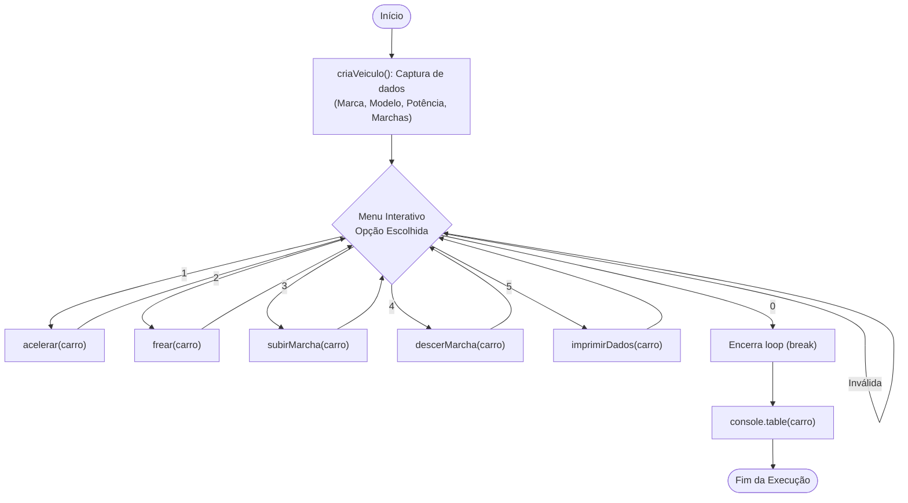
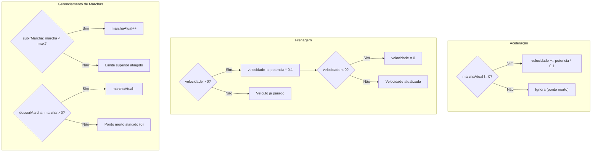

# 🚗 Simulação de Veículo — Prática de Git & TypeScript

Projeto acadêmico desenvolvido para a disciplina de **Engenharia de Software II** no **SENAC**, sob orientação do **Prof. Wagner Loch**. O objetivo principal é exercitar o fluxo de trabalho colaborativo com controle de versão via **Git** (Git Flow, branches de feature, pull requests, commits atômicos e rastreabilidade de requisitos) aliado a conceitos de **Programação Orientada a Objetos (POO)** e boas práticas em **TypeScript**.

---

## 📌 Sobre o Projeto

O projeto consiste em uma aplicação de linha de comando (CLI) interativa que modela e simula o comportamento e estado de um veículo (marca, modelo, potência, número de marchas, marcha atual e velocidade). 

Através de um menu dinâmico no terminal, o usuário cadastra o veículo e interage executando operações com regras de negócio e validações de invariantes de estado (acelerar, frear, subir marcha, descer marcha e exibir os dados em formato tabular).

---

## 🛠️ Tecnologias Utilizadas

- **[TypeScript](https://www.typescriptlang.org/)** (v5.5.4) — Superset tipado do JavaScript
- **[Node.js](https://nodejs.org/)** — Ambiente de execução JavaScript
- **[ts-node](https://typestrong.org/ts-node/)** (v10.9.2) — Execução direta de código TypeScript sem etapa manual de build
- **[prompt-sync](https://www.npmjs.com/package/prompt-sync)** (v4.2.0) — Captura síncrona de entradas do usuário via terminal

---

## 📁 Estrutura do Projeto

```plaintext
quest3-ES2/
├── .gitignore        # Arquivos e diretórios desconsiderados pelo versionador
├── Veiculo.ts        # Definição da classe Veiculo e seus atributos tipados
├── index.ts          # Ponto de entrada, menu interativo e regras de negócio
├── requisitos.MD     # Checklist de requisitos e acompanhamento da prática
├── package.json      # Dependências e scripts de execução/build
├── package-lock.json # Lockfile das dependências instaladas
├── tsconfig.json     # Configuração do compilador TypeScript
├── PULL_REQUEST.md   # Modelo e documentação detalhada para o Pull Request (dev -> main)
└── README.md         # Documentação oficial e completa do projeto
```

---

## 📋 Status dos Requisitos

Com base no planejamento definido em [`requisitos.MD`](requisitos.MD), todos os requisitos foram plenamente implementados e validados:

| # | Requisito | Status | Implementação | Descrição |
|---|---|:---:|---|---|
| **1** | Criar objeto a partir da classe Veículo | Concluído | `new Veiculo()` | Instanciação da classe com valores tipados |
| **2** | Criar veículo (entrada de dados) | Concluído | `criaVeiculo()` | Captura e conversão de dados fornecidos pelo usuário no terminal |
| **3** | Imprimir dados do veículo | Concluído | `imprimirDados()` | Exibição formatada dos atributos do objeto via `console.table()` |
| **4** | Acelerar | Concluído | `acelerar()` | Acelera proporcionalmente à potência ($+10\%$), impedindo aceleração em ponto morto |
| **5** | Frear | Concluído | `frear()` | Desaceleração proporcional ($-10\%$ da potência), com bloqueio de velocidade negativa |
| **6** | Subir marcha | Concluído | `subirMarcha()` | Incremento unitário respeitando o limite máximo (`numeroMarchas`) |
| **7** | Reduzir marcha | Concluído | `descerMarcha()` | Redução unitária respeitando o piso mínimo do ponto morto (`0`) |

---

## 🎮 Como Funciona a Aplicação

### 1. Inicialização e Cadastro
Ao iniciar, a aplicação solicita os atributos iniciais do veículo:
- **Marca** (ex: `Toyota`)
- **Modelo** (ex: `Corolla`)
- **Potência** (ex: `150`)
- **Número de marchas** (ex: `6`)

### 2. Menu Interativo
Após o cadastro, o loop do menu é iniciado:
```text
########### MENU ###########
1 - Acelerar
2 - Frear
3 - Subir marcha
4 - Descer marcha
5 - Imprimir dados do veículo
0 - Sair
Escolha uma opção: 
```

### 3. Regras de Negócio e Validações
- **Acelerar:**
  - O veículo só ganha velocidade se a marcha engrenada for maior que zero (`marchaAtual != 0`).
  - Ganho de velocidade: $\text{velocidade} = \text{velocidade} + (\text{potencia} \times 0.1)$.
- **Frear:**
  - O veículo só desacelera se a velocidade atual for maior que zero (`velocidade > 0`).
  - Redução: $\text{velocidade} = \text{velocidade} - (\text{potencia} \times 0.1)$.
  - Caso a velocidade caia abaixo de zero, é aplicado *clamping* fixando o valor em `0`.
- **Subir Marcha:**
  - Incrementa em 1 a marcha atual apenas se $\text{marchaAtual} < \text{numeroMarchas}$.
- **Descer Marcha:**
  - Decrementa em 1 a marcha atual apenas se $\text{marchaAtual} > 0$ (ponto morto).

---

## 📊 Fluxogramas do Sistema

### Fluxo de Execução da Aplicação (CLI)



### Regras de Negócio e Transição de Estados



---

## 🌿 Fluxo Git & Práticas de Engenharia Adotadas

Durante o desenvolvimento foram aplicadas convenções e metodologias alinhadas às boas práticas de Engenharia de Software:

1. **Git Flow & Feature Branching:**
   - `main`: Branch de produção/entrega final estável.
   - `dev`: Branch integradora de desenvolvimento.
   - `feature/frear-e-imprimir-dados`: Implementação dos requisitos 3 e 5.
   - `feature/implementa-funcoes-veiculo`: Implementação dos requisitos 6 e 7.
2. **Pull Requests & Code Review:**
   - Integração colaborativa entre os desenvolvedores através de PRs avaliados antes do merge em `dev`.
3. **Conventional Commits:**
   - Histórico padronizado (`feat:`, `refact:`, `merge:`) facilitando a leitura de changelogs e rastreabilidade.
4. **Clean Code & Tipagem Estática:**
   - Código modularizado, variáveis e métodos descritivos, validação estática de tipos via compilador do TypeScript (`tsc`).
5. **Higiene de Repositório:**
   - Configuração de [.gitignore](.gitignore) para manter dependências (`node_modules`) fora do controle de versão.

---

## 🚀 Como Executar o Projeto

### Pré-requisitos
- [Node.js](https://nodejs.org/) (versão LTS recomendada)
- Gerenciador de pacotes `npm`

### Passo a passo

1. **Clonar o repositório:**
   ```bash
   git clone git@github.com:joaowatanabe/quest3-ES2.git
   cd quest3-ES2
   ```

2. **Instalar as dependências:**
   ```bash
   npm install
   ```

3. **Executar a aplicação:**
   ```bash
   npm start
   ```

4. **Verificar tipagem (typecheck):**
   ```bash
   npx tsc --noEmit
   ```

5. **Compilar para JavaScript (opcional):**
   ```bash
   npm run build
   ```

---

## 👨‍💻 Autores e Créditos

- **Alunos:**
  - [João Watanabe](https://github.com/joaowatanabe)
  - [Lucas Campello](https://github.com/lucascampello0210-oss)
- **Orientação:** Prof. Wagner Loch
- **Instituição:** Faculdade SENAC — Engenharia de Software II
